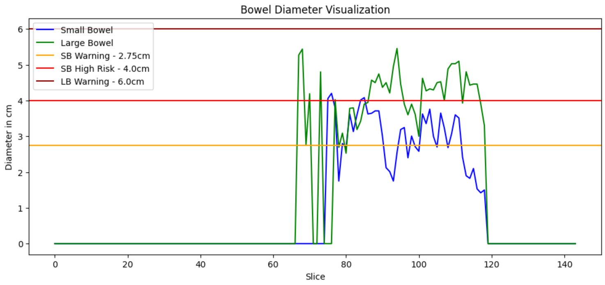
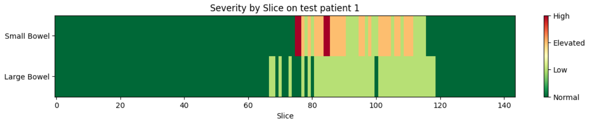

# Bowel Segmentation using SegFormer

An Automated bowel segmentation and obstruction detection pipeline from 3D MRI scans using SegFormer.

## Overview

This project segments small bowel, large bowel, and stomach from MRI scans, then analyzes the segmentation masks to detect potential bowel obstruction by measuring bowel diameter against clinically-verfied bowel diameter thresholds.

## Pipeline

- **Preprocessing**: N4 bias field correction, NLM denoising, and Image augumentations
- **Segmentation**: Fine-tuned SegFormer model achieving 75% mean IoU across 3 organ classes
- **Obstruction Detection**: Skeletonization-based diameter measurement to flag dilation risk
- **Severity Stratification**: 4-tier risk classification (normal, low risk, elevated, high risk)
- **Visualization**: Slice-level heatmaps and bowel diameter plots

## Dataset

- 467 de-identified MRI scans from 107 patients
- ~144 axial slices per scan
- Pixel resolution: 1.5 x 1.5 x 3 mm
- 40,000+ total slices processed

## Installation

```bash
git clone https://github.com/Rohith-Kumar-S/BowelSegmentation-MRI.git
cd BowelSegmentation-MRI
pip install -r requirements.txt
```

### Requirements

```
torch
torchvision
transformers
numpy
tqdm
albumentations
matplotlib
ipywidgets
kagglehub
pandas
opencv-python
SimpleITK
antspyx
scikit-learn
scipy
scikit-image
```

## Clinical Thresholds

Diameter thresholds based on peer-reviewed research for small bowel obstruction detection:

| Threshold | Small Bowel | Large Bowel | Interpretation |
|-----------|-------------|-------------|----------------|
| Normal | ≤1.7 cm | ≤3.0 cm | Rule out obstruction |
| Low Risk | <2.75 cm | <6.0 cm | Monitor |
| Elevated | <4.0 cm | <9.0 cm | Possible obstruction |
| High Risk | ≥4.0 cm | ≥9.0 cm | Likely obstruction |

Reference: 
https://pubmed.ncbi.nlm.nih.gov/39043061/
https://pubmed.ncbi.nlm.nih.gov/40357737/


## Results

### Segmentation Performance

| Class | IoU |
|-------|-----|
| Background | 99.76% |
| Small Bowel | 55.08% |
| Large Bowel | 68.93% |
| Stomach | 76.79% |
| **Mean** | **74.89%** |

### Sample Visualizations

**Diameter Profile Plot**
Bowel diameter across slices with clinical threshold lines, highlighting regions of concern.


**Severity Heatmap**
Risk levels across all slices for both small and large bowel.


## Acknowledgments

- Dataset: [Source if applicable]
- Clinical thresholds: National Library of Medicine research